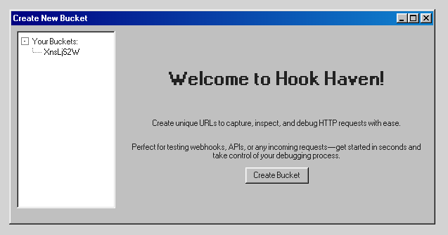
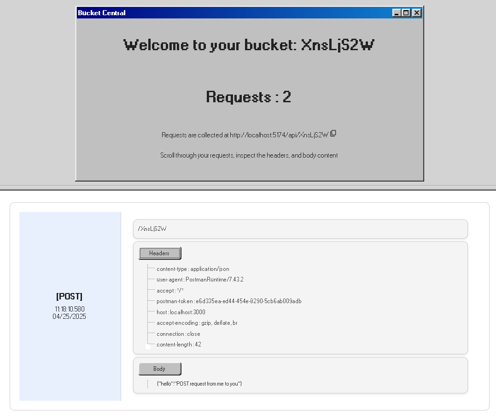

  

# Hook Haven

A full-stack webhook testing tool for inspecting HTTP requests. Built with React, TypeScript, Node.js, Express, PostgreSQL, MongoDB, with NGINX-based routing, originally deployed on DigitalOcean.

It allows developers to capture, inspect, and debug HTTP requests with ease. Unique URLs can be generated to capture requests, test webhooks, and inspect incoming data in a retro Windows 98-inspired interface (for that sweet nostalgia).

## Features

🪣 Create Custom Buckets: Generate unique URLs to collect incoming HTTP requests  
📋 Request Inspection: View detailed information about headers, body content, and request metadata  
📁 Request History: Browse through a chronological list of all requests sent to your bucket  
💾 Local Storage: Buckets are saved in your browser's local storage for easy access (and to create some persistence between reloads)  
🎨 Retro UI: Nostalgic Windows 98-style interface

## How It Works

- Create a "bucket" with a unique ID (e.g., `XnsLjS2W`)
- Send HTTP requests to your bucket URL: `/api/XnsLjS2W` (this can be tested with Postman)
- View all captured requests, including headers and body data, in the web interface

## Technologies

### Frontend

- React (with React Router for navigation) + Vite
- TypeScript
- 98.css for Windows 98-style UI components
- Local Storage API for associating bucket IDs with a user

### Backend

- Node.js with Express
- PostgreSQL for storing bucket metadata and request information (including request method and header)
- MongoDB for storing request body content (request body / payload)
- TypeScript for type safety

## System Architecture

Hook Haven uses a dual-database approach:

1. **PostgreSQL** stores:

- Bucket information (UUIDs, creation timestamps)
- Request metadata (method, headers, timestamps)
- Reference to the MongoDB document ID

2. **MongoDB** stores:

- Request body content/payload (as JSON strings)

This separation allows for efficient storage and retrieval of different data types while maintaining referential integrity.

## API Routes

### Bucket Creation and Viewing

`POST /api/web` - Create a new bucket

- Response: UUID of the new bucket

`GET /api/web/:id` - Get all requests for a specific bucket

- Response: Array of request objects with metadata and body content

### Request Capture

`ANY /api/:id` - Capture any HTTP request sent to this endpoint

- Any HTTP method (GET, POST, PUT, DELETE, etc.) is accepted and stored
- Headers and body are captured and stored
- Response: 200 OK if successful, 404 if bucket not found

## Example Usage

Note: The example usage below presumes a bucket with a UUID of 'XnsLjS2W'. In reality, the UUID will be randomly generated.

### Creating a Bucket

`POST /api/web` - this can be achieved by clicking the `Create Bucket` button on the UI

- Example Response: `"XnsLjS2W"` - the UUID for the created bucket.

  

### Sending Requests to a Bucket

`POST /api/XnsLjS2W`

- Body: {"hello": "POST request from me to you"}
- Headers: {"Content-Type": "application/json"}
- Example Response: 200 OK (presuming successful)

Again, for testing purposes, this can be achieved via Postman.

### Viewing Bucket Requests

`GET /api/web/XnsLjS2W`

- Example Response: [
  {
  "id": "1",
  "method": "POST",
  "requestTime": "2025-05-25T11:18:10.580Z",
  "headers": "{\"Content-Type\":\"application/json\"}",
  "body": "{\"hello\":\"POST request from me to you\"}"
  }
  ]

Note: To actually see the created bucket, navigate to `/web/XnsLjS2W` and the request(s) will be displayed in the UI.

  

## Running Hook Haven locally

### Prerequisites

- Node.js and npm installed
- PostgreSQL installed and set up
- MongoDB installed and set up

### Installation

Clone the repository

`git clone https://github.com/LiamTurner347/hook-haven.git`  
`cd hook-haven`

### Install dependencies for both frontend and backend

`cd backend`  
`npm install`  
`cd ../frontend`  
`npm install`

### Set up environment variables

In the backend directory, create a `.env` file with:  
`POSTGRES_USER`=your_postgres_user  
`POSTGRES_HOST`=localhost  
`POSTGRES_PW`=your_postgres_password  
`POSTGRES_DATABASE`=hookhaven  
`POSTGRES_PORT`=5432  
`MONGO_URL`=your_mongo_cluster_url  
`EXPRESS_PORT`=3000

### Start the backend server

In the `backend` directory:  
`npm run dev`

### Start the frontend development server

In the `frontend` directory:  
`npm run dev`

Open your browser and navigate to `http://localhost:5173` (or the port shown in your terminal)

## Deployment Considerations

This application was previously deployed on a Digital Ocean droplet with:

- NGINX as a reverse proxy
- PostgreSQL and MongoDB running on the same server
- PM2 for process management
- ufw for firewall
- SSL certificate provided by Certbot

Due to hosting costs, the deployment has been removed, and the application is now intended for local use only.
